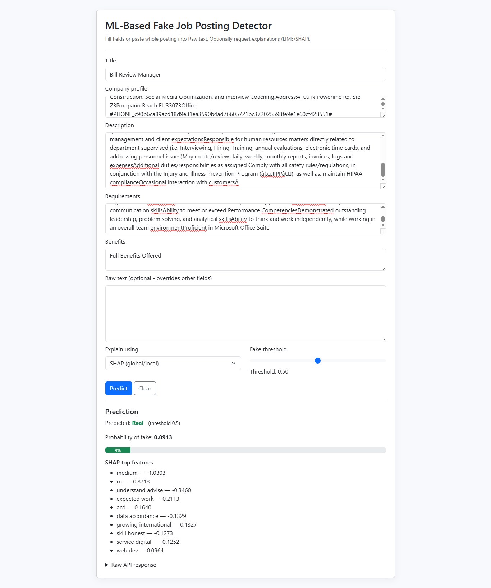

# 🕵️‍♂️ Fake Job Postings Detector  

## 📌 What is this Project?  
This project is about detecting **fake job postings** on the internet.  
Many people apply for jobs online, but not all postings are real — some are scams to steal personal information or money.  
This system uses **Machine Learning (ML) and Natural Language Processing (NLP)** to classify job postings as **Real** or **Fake**.  

---

## 📖 About this Project  
- Built as my **Final Project**.  
- Uses the **Fake Job Postings Dataset** from Kaggle.  
- The data contains job details like **title, company profile, description, requirements, benefits** etc.  
- The goal is to **learn from these details** and build a model that can automatically detect fake jobs.  

---

## 🔎 Project Overview  
1. **Data Preprocessing**  
   - Cleaned text (lowercasing, removing stopwords, lemmatization).  
   - Handled missing values and combined multiple job text fields.  

2. **Exploratory Data Analysis (EDA)**  
   - Found that the dataset is **imbalanced** (very few fake postings).  
   - Plotted word clouds, top frequent words, and fraud distribution.  

3. **Feature Engineering**  
   - Used **TF-IDF** to convert job text into numerical features.  

4. **Model Training**  
   - Trained **Logistic Regression, SVM, and XGBoost**.  
   - Compared results using **Accuracy, Precision, Recall, F1-score, ROC-AUC**.  
   - XGBoost gave the best performance.  

5. **Explainability**  
   - Used **SHAP & LIME** to explain why the model predicts a job as fake or real.  

6. **Deployment**  
   - Built a simple **Flask web app** where users can enter job details and get predictions.  

---

## 🖼️ Screenshots (Real vs Fake Comparison)  

| Real Job Prediction ✅ | Fake Job Prediction ❌ |  
|------------------------|------------------------|  
|  |  |  

---

## 🌍 Real World Use  
- Helps **job seekers** avoid scams and fraud postings.  
- Can be integrated into **job portals** like LinkedIn, Indeed, or Naukri.  
- Saves time and increases trust by **filtering out fraudulent postings** before they reach applicants.  

---

## 🛠️ Technical Tags  
- **Languages:** Python  
- **Libraries:** Pandas, Numpy, Scikit-learn, XGBoost, Flask, NLTK, SHAP, LIME  
- **Techniques:** NLP, TF-IDF, ML Classification, Explainability  
- **Deployment:** Flask web application  

---

## 🚀 How I Approached the Project  
1. Started with **data exploration** to understand the dataset.  
2. Performed **text cleaning and preprocessing**.  
3. Applied **TF-IDF feature extraction** to represent job text.  
4. Trained **multiple ML models** and tuned hyperparameters.  
5. Evaluated and selected the **best model** (XGBoost).  
6. Added **explainability (SHAP/LIME)** for transparency.  
7. Finally, created a **Flask app** to make it user-friendly.  

---

## 📝 Final Summary  
This project shows how **Machine Learning and NLP** can be used to solve a **real-world problem** of detecting fake job postings.  
The system can be extended with **deep learning models** and deployed on a large scale for **job portals**.  
It is a **practical and impactful solution** for protecting people from job scams.  

---
